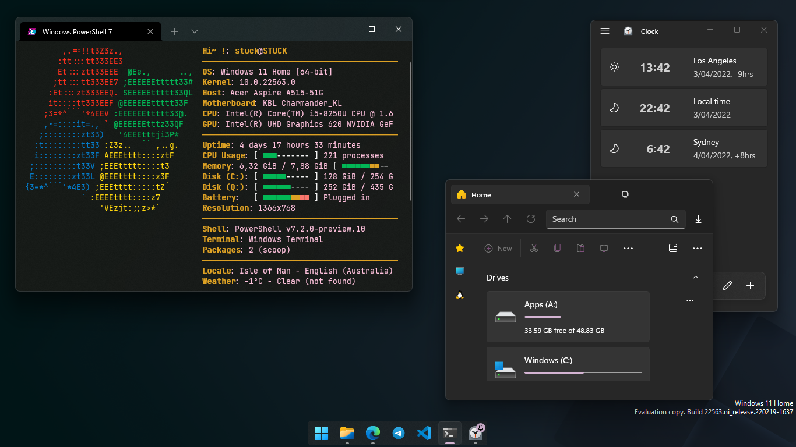
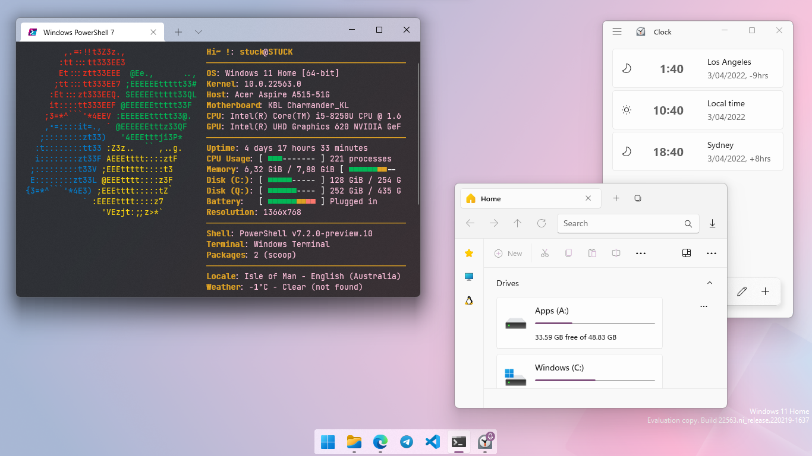

<h3>

  | webbidingsㅤㅤㅤㅤ🗕 🗖 ✖ |
  | ------------------------ |
  |  |

</h3>

| Dark | Light |
| ---- | ----- |
|  |  |

<h3>Webbidings is a soft and vibrant color scheme inspired by ducks, space and
ducks in space.</h3>

Nevermind what was in this readme before, i'm not doing that

